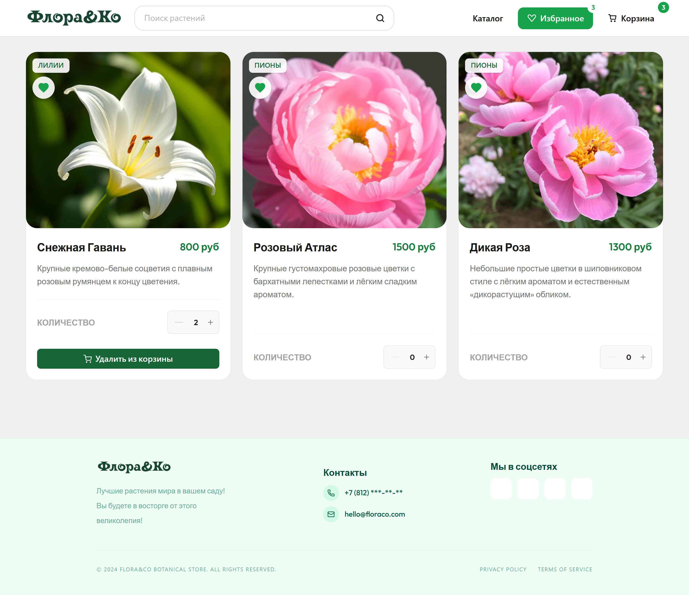
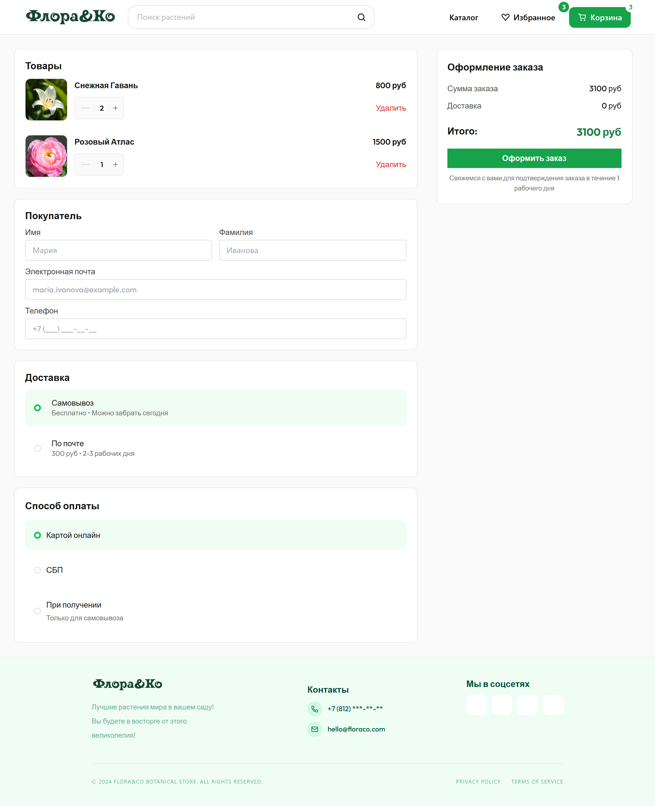

# Flora&Co

🇬🇧 English version: [README.md](README.md)

Интернет-магазин садовых растений, разработанный на React, TypeScript и Tailwind CSS.

Flora&Co — адаптивное веб-приложение для интернет-магазина, позволяющее просматривать каталог растений, искать товары, добавлять их в избранное и корзину, а также оформлять заказ.

Данная версия проекта представляет собой развитие первоначальной реализации на JavaScript. В ходе работы приложение было полностью переведено на TypeScript с сохранением существующей функциональности и последующей типизацией компонентов, страниц, контекстов и моделей данных.

## Демо

[Открыть сайт](https://flora-co-react-typescript-alevtina-work1.vercel.app)

## Изначальная версия

Версия JavaScript:
https://github.com//Alevtina-work/Flora_co-react-js

## Скриншоты

### Каталог


### Избранное



### Оформление заказа



## Возможности

- каталог растений;
- поиск товаров;
- фильтрация по категориям;
- избранное;
- корзина;
- оформление заказа;
- адаптивная верстка для мобильных устройств и десктопов.

## Технологии

- React 18
- TypeScript
- Vite
- Tailwind CSS
- React Router
- Context API


## Запуск проекта

1. Установка зависимостей:
```bash
npm install
```
2. Запуск проекта:
```bash
npm run start
```
3. После запуска приложение будет доступно по адресу:

```
http://localhost:4028
```

## Сборка

```bash
npm run build
```

## Структура проекта

```
src
├── components
│   ├── common
│   └── ui
├── context
├── pages
│   ├── CatalogPage
│   ├── CheckoutPage
│   └── FavoritesPage
├── types
├── styles
├── App.tsx
├── Routes.tsx
└── main.tsx
```

## Стилизация

Проект использует Tailwind CSS с собственной дизайн-системой.

- собственная цветовая палитра;
- адаптивная верстка;
- переиспользуемые UI-компоненты;
- tailwind-merge для композиции CSS-классов.

## Процесс разработки

- Интерфейс был разработан в Figma.
- С помощью Rocket.new была сгенерирована начальная структура React-компонентов.
- Полученный код использовался в качестве отправной точки: архитектура приложения, бизнес-логика, маршрутизация, управление состоянием, переиспользуемые компоненты, доработка интерфейса и дополнительная функциональность были реализованы / существенно переработаны вручную.
- После завершения JavaScript-версии проект был полностью перенесён на TypeScript с сохранением существующего поведения и последующей типизацией всей кодовой базы

## TypeScript

В отличие от первоначальной версии проекта, приложение полностью типизировано.

В процессе миграции были:

- переведены на TypeScript все страницы и компоненты;
- типизированы Context API;
- выделены общие интерфейсы моделей данных (Product, CartItem и др.);
- заменены  на строгие интерфейсы неявные типы (any);
- типизированы обработчики событий React;
- переработаны пропсы компонентов;
- улучшена безопасность работы с состоянием приложения.